# Hermes Vault

**Secrets, Identity & Trust Plane for Jarvas/Hermes**

Repositório canónico para desenhar, implementar e operar uma camada HashiCorp Vault integrada com Jarvas/Hermes, Hermes MCP Bridge V2, RITMO, dispatchers e ferramentas autenticadas.

## Estado

**Fase atual:** architecture & implementation blueprint.  
**Implementação em produção:** ainda não iniciada.  
**Objetivo de retoma:** permitir iniciar uma nova conversa e dizer apenas **“vamos implementar o HashiCorp Vault”**, usando este repositório como fonte de verdade.

## Objetivo principal

Substituir progressivamente segredos estáticos espalhados por ficheiros, variáveis de ambiente e configurações locais por um plano centralizado de **segredos, identidade de workloads, autorização, criptografia, PKI, auditoria e recuperação**.

Princípios:

1. **NO SECRET TO THE MODEL** — segredos não entram no contexto do ChatGPT/LLM.
2. **IDENTITY + POLICY PER TOOL** — cada workload/MCP/tool possui identidade própria e mínimo privilégio.
3. **SHORT-LIVED CAPABILITY WHEN POSSIBLE** — preferir tokens, certificados e credenciais temporárias.
4. **JIT PRIVILEGE ELEVATION** — administração privilegiada apenas quando necessária e com TTL curto.
5. **ROOT IS BREAK-GLASS ONLY** — root/recovery nunca são credenciais permanentes do Hermes.
6. **AUDIT EVERYTHING** — acesso a segredos e operações privilegiadas deixam evidência auditável.
7. **FAIL CLOSED** — ausência de identidade, policy, lease ou autorização válida bloqueia a operação.

## Arquitetura alvo

```mermaid
flowchart TD
    U[Utilizador] --> C[ChatGPT]
    C --> B[Hermes MCP Bridge V2]
    B --> P[Intent / Batch Planner]
    P --> E[Policy & Risk Engine]
    E --> CB[Credential Broker]
    CB --> V[HashiCorp Vault]

    V --> VA[Vault Agent / Auth]
    V --> KV[KV v2]
    V --> PKI[PKI]
    V --> TR[Transit]
    V --> DS[Dynamic Secrets]
    V --> AU[Audit]

    CB --> GH[GitHub Tool]
    CB --> GF[Grafana Tool]
    CB --> CF[Cloudflare Tool]
    CB --> MS[Planner / Outlook MCP]
    CB --> HA[Home Assistant]
    CB --> RT[RITMO / Dispatchers]

    GH --> EV[Operational Evidence]
    GF --> EV
    CF --> EV
    MS --> EV
    HA --> EV
    RT --> EV
    TR --> EV
```

## Modelo de privilégio

| Nível | Identidade | Finalidade |
|---|---|---|
| L1 | `hermes-runtime` | Operação normal e consumo de capacidades autorizadas |
| L2 | `hermes-controller` | Gestão de integrações, leases, credenciais e operações de controlo |
| L3 | `hermes-vault-admin` | Administração JIT do Vault com TTL curto e auditoria reforçada |
| L4 | `root/recovery` | Break-glass e recuperação catastrófica; fora do Hermes |

## Conteúdo do repositório

- [`docs/00-context-goals.md`](docs/00-context-goals.md) — contexto, objetivos e não-objetivos.
- [`docs/01-reference-architecture.md`](docs/01-reference-architecture.md) — arquitetura e trust boundaries.
- [`docs/02-vault-capabilities.md`](docs/02-vault-capabilities.md) — catálogo de capacidades e aplicabilidade ao Jarvas/Hermes.
- [`docs/03-identity-auth-policy.md`](docs/03-identity-auth-policy.md) — identidades, auth methods, policies e least privilege.
- [`docs/04-hermes-integration.md`](docs/04-hermes-integration.md) — Credential Broker, direct-tool execution e batch execution.
- [`docs/05-jit-privilege.md`](docs/05-jit-privilege.md) — privilege elevation, admin temporário e approvals.
- [`docs/06-pki-mtls.md`](docs/06-pki-mtls.md) — PKI, certificados curtos e mTLS entre serviços.
- [`docs/07-transit-evidence.md`](docs/07-transit-evidence.md) — Transit, HMAC, signing e evidência criptográfica.
- [`docs/08-audit-observability.md`](docs/08-audit-observability.md) — auditoria, métricas, Grafana e deteção de abuso.
- [`docs/09-bootstrap-recovery.md`](docs/09-bootstrap-recovery.md) — bootstrap, unseal, recovery e break-glass.
- [`docs/10-operations-runbooks.md`](docs/10-operations-runbooks.md) — operação diária e runbooks.
- [`docs/11-migration-plan.md`](docs/11-migration-plan.md) — migração progressiva dos segredos atuais.
- [`docs/12-implementation-roadmap.md`](docs/12-implementation-roadmap.md) — fases, gates e critérios de aceitação.
- [`docs/13-security-decisions.md`](docs/13-security-decisions.md) — decisões arquiteturais e restrições.
- [`docs/14-references.md`](docs/14-references.md) — documentação oficial de referência.
- [`docs/15-delivery-operating-model.md`](docs/15-delivery-operating-model.md) — FAST DELIVERY, multi-lane, Controller/Integration, waves, gates e Definition of Delivery.

## Resultado pretendido

No estado final, um pedido como:

> “Verifica o CI no GitHub, consulta o email do deployment e compara com as métricas do Grafana.”

pode ser decomposto pela Hermes Bridge V2 em operações independentes. Cada executor autentica-se com identidade própria, obtém do Vault apenas a capacidade necessária, executa, produz evidência e perde essa capacidade no fim do TTL ou lease.

O ChatGPT controla a intenção e o plano de execução; **não recebe nem conserva os segredos subjacentes**.

## Regra de implementação

Nenhum secret real deve ser versionado neste repositório. Exemplos de configuração usam apenas placeholders, referências a paths Vault ou nomes fictícios.
