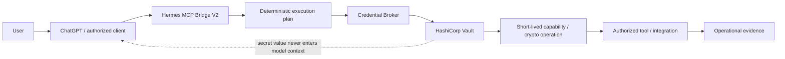
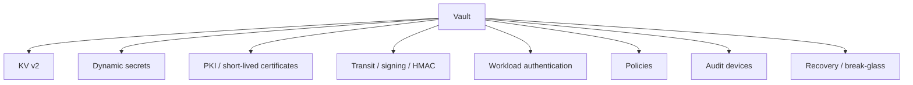
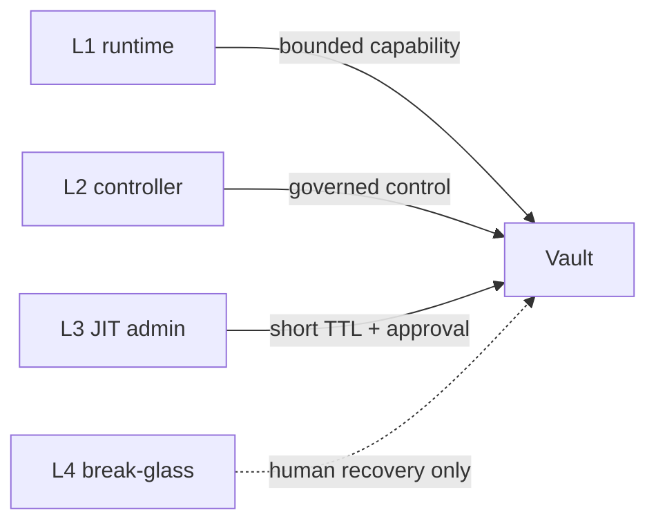
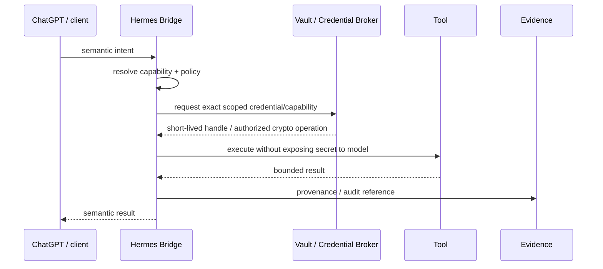

# Hermes Vault

[](docs/README.md)
[](#current-state)
[](SECURITY.md)
[](docs/01-reference-architecture.md)

> Canonical design and implementation plan for a future **Secrets, Identity & Trust Plane** for Jarvas/Hermes, based on HashiCorp Vault.

## Current state

**Architecture and implementation blueprint. Production implementation has not started.**

This repository is intentionally detailed enough to resume implementation safely in a future session, but it must not be read as proof that Vault, PKI, dynamic secrets or JIT privilege are already running on the Jarvas/Hermes host.

| Area | Current state |
|---|---|
| Architecture / trust model | ✅ Documented |
| Identity/auth/policy design | ✅ Documented |
| Migration and recovery design | ✅ Documented |
| Example policies/templates | ✅ Present, non-secret |
| Vault runtime installation | ⏳ Not started |
| Secret migration | ⏳ Not started |
| Workload identity rollout | ⏳ Not started |
| PKI / mTLS rollout | ⏳ Not started |
| Production acceptance | ⏳ Not started |

## Objective

Progressively replace long-lived static credentials distributed across files, environment variables and local configuration with a centralized trust plane for:

- secrets lifecycle;
- workload identity and least privilege;
- short-lived credentials where supported;
- JIT privileged administration;
- PKI and mTLS;
- Transit encryption/signing/HMAC;
- audit and evidence;
- bootstrap, recovery and break-glass.

## Security invariants

```text
NO SECRET TO THE MODEL
IDENTITY + POLICY PER TOOL
SHORT-LIVED CAPABILITY WHEN POSSIBLE
JIT PRIVILEGE ELEVATION
ROOT IS BREAK-GLASS ONLY
AUDIT EVERYTHING
FAIL CLOSED
```

These are design constraints for implementation, not marketing statements.

## Target system context



## Target Vault capabilities



Not every engine is automatically required. Implementation should enable only capabilities justified by real consumers and operational evidence.

## Privilege model

| Level | Identity | Intended scope |
|---:|---|---|
| L1 | `hermes-runtime` | Routine consumption of explicitly allowed capabilities |
| L2 | `hermes-controller` | Integration/lease/credential control operations |
| L3 | `hermes-vault-admin` | Temporary JIT Vault administration with short TTL and stronger approval/audit |
| L4 | root / recovery | Catastrophic recovery and break-glass, outside Hermes automation |



## Target request flow



## What this repository contains today

- architecture, trust-boundary and threat-model documentation;
- identity/auth/policy design;
- Hermes/Bridge integration design;
- JIT privilege, PKI/mTLS and Transit design;
- audit/observability model;
- bootstrap/unseal/recovery guidance;
- migration plan and implementation roadmap;
- security decisions and official references;
- example HCL policies containing no real secrets;
- sanitized inventory and workload-identity templates;
- implementation checklist and a dedicated resume point.

## Ownership & HSL generalization

`hermes-vault` **owns** the shared Vault service lifecycle (deployment, policy, bootstrap, recovery). The working patterns from `pestoura/hermes-security-labs` `deployment/vault-lab-l1` (single-node Raft, TLS, AppRole signer, transit key) have been generalized INTO this shared service as the canonical baseline under `deployments/vault/` (see [`docs/runbooks/hsl-generalization.md`](docs/runbooks/hsl-generalization.md)). The HSL deployment is **superseded** for the target architecture; HSL is a consumer of the shared service only and does not re-own the deployment. `hermes-vault` performs no write to HSL; cross-repo HSL migration is out of scope here.

## What it does **not** contain today

- a deployed Vault server/cluster;
- initialized/unsealed production storage;
- real Vault tokens, recovery keys or unseal material;
- migrated production secrets;
- active dynamic-secret engines;
- active PKI/mTLS issuance;
- a live Credential Broker;
- production evidence proving the target architecture.

## Documentation

Start with the [documentation index](docs/README.md).

Recommended reading order:

1. [`docs/00-context-goals.md`](docs/00-context-goals.md)
2. [`docs/01-reference-architecture.md`](docs/01-reference-architecture.md)
3. [`docs/03-identity-auth-policy.md`](docs/03-identity-auth-policy.md)
4. [`docs/04-hermes-integration.md`](docs/04-hermes-integration.md)
5. [`docs/09-bootstrap-recovery.md`](docs/09-bootstrap-recovery.md)
6. [`docs/12-implementation-roadmap.md`](docs/12-implementation-roadmap.md)
7. [`docs/13-security-decisions.md`](docs/13-security-decisions.md)
8. [`docs/15-threat-model.md`](docs/15-threat-model.md)

For resuming implementation, use [`RESUME.md`](RESUME.md) and [`IMPLEMENTATION-CHECKLIST.md`](IMPLEMENTATION-CHECKLIST.md).

## Implementation gate

The first real implementation phase must begin with **read-only discovery** of the current Jarvas/Hermes environment. Historical assumptions in this repository must be revalidated before installation or migration.

No Vault installation or secret migration should begin until the Phase 0 entrance criteria are satisfied:

```text
DISCOVERY_COMPLETE
NO_SECRET_IN_REPO
TARGET_ARCHITECTURE_APPROVED
RECOVERY_DESIGN_DEFINED
```

## Repository safety rule

No real secret, token, password, unseal/recovery key, certificate private key or reusable credential may be committed here. Examples must use fictitious names, placeholders or Vault path references only.
