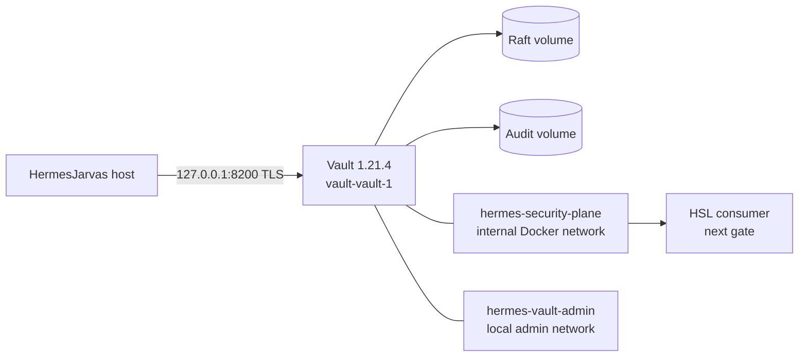
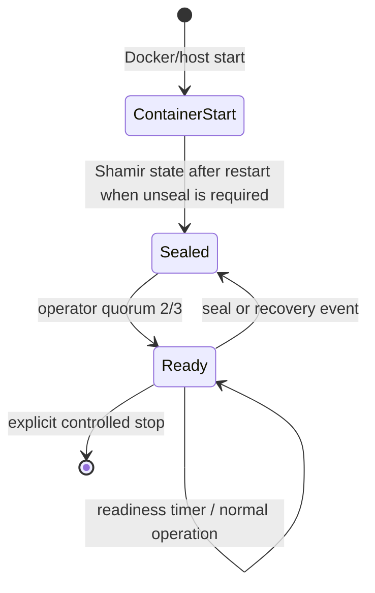
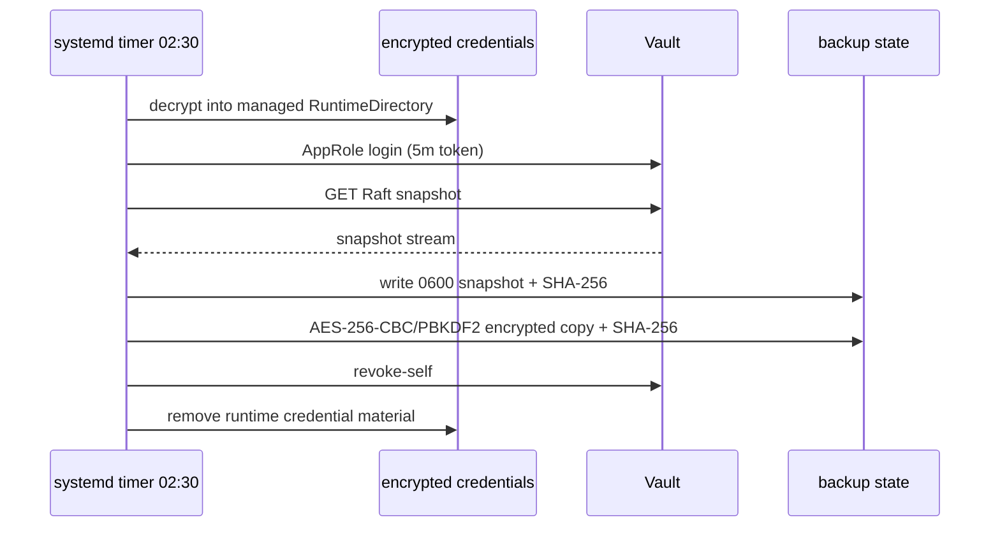
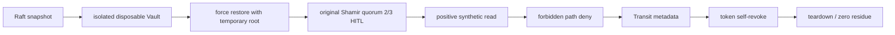

# Hermes Vault

[](https://github.com/pestoura/hermes-vault/actions/workflows/fast-gates.yml)
[](docs/16-current-runtime-status.md)
[](docs/16-current-runtime-status.md)
[](docs/evidence/2026-08-21-adr-023-live-acceptance.md)
[](SECURITY.md)

**Hermes Vault is the shared Secrets, Identity & Trust Plane for HermesJarvas. `hermes-vault` **owns** the shared Vault service lifecycle, while consumers own only their use of issued capabilities.** It runs HashiCorp Vault Community as a persistent Docker service with strict TLS, single-node Raft, Shamir 3/2, audit, certificate-based JIT administration, encrypted scheduled snapshots and tested isolated recovery.

The core service is live and verified. Consumer onboarding remains separately gated; the first consumer is Hermes Security Labs (HSL).

## Current state

```text
VAULT_CORE_OPERATIONAL=VERIFIED
VAULT_CORE_OPERATIONAL_RUNTIME_PASS=VERIFIED
RESTORE_DRILL_PASS=VERIFIED
SCHEDULED_SNAPSHOT_PASS=VERIFIED
FIRST_CONSUMER_BOOTSTRAP=NOT_RUN
UNSEALED_READY=false
JIT_SELF_REVOKE_REVALIDATION=PENDING
```

See the canonical runtime ledger: [`docs/16-current-runtime-status.md`](docs/16-current-runtime-status.md).

## Verified capabilities

| Capability | State |
|---|---|
| Vault 1.21.4 exact-digest runtime | **VERIFIED** |
| Docker persistent lifecycle | **VERIFIED** — `restart: unless-stopped` |
| Strict TLS | **VERIFIED** |
| Integrated Storage / Raft | **VERIFIED** |
| Shamir 3/2 | **VERIFIED** — manual quorum retained |
| File audit | **VERIFIED** |
| Certificate JIT administration | **VERIFIED**, lifecycle revalidation noted below |
| Initial root retirement | **VERIFIED** |
| Isolated Raft restore drill | **VERIFIED** — `RESTORE_DRILL_PASS` |
| Secret-free readiness assurance | **ACTIVE** |
| Scheduled encrypted Raft snapshot | **ACTIVE** — `SCHEDULED_SNAPSHOT_PASS` |
| HSL first consumer | **NOT_RUN** |
| General secret migration | **NOT_RUN** |
| Credential Broker | **NOT_RUN** |
| PKI / mTLS rollout | **NOT_RUN** |

`VAULT_CORE_OPERATIONAL` means the shared Vault service itself is running, recoverable and continuously assured. It does **not** mean every planned Hermes consumer or future Vault capability is already enabled.

## Runtime topology



The consumer-facing DNS alias is `hermes-vault`. Host administration remains loopback-only. Port `8201` is not host-published and the Vault UI is disabled.

## 24/7 lifecycle

Docker starts with HermesJarvas and the Vault container is configured to restart automatically unless explicitly stopped. The service intentionally does **not** use auto-unseal.



A machine restart can therefore restore the **service process** automatically while still preserving the human recovery boundary. `SEALED_NEEDS_QUORUM` is a legitimate controlled state; automation must never reconstruct or handle Shamir shares.

## Continuous assurance

`hermes-vault-readiness.timer` runs a token-free, read-only control loop. It verifies the expected container, image/topology, restart policy and strict-TLS health endpoint.

Expected evidence:

```text
VAULT_24X7_TOPOLOGY_PASS RestartPolicy=unless-stopped
code=200 initialized=true sealed=false
VAULT_24X7_READY
```

The check does not unseal Vault, mutate configuration, read secrets or inspect audit contents.

## Scheduled encrypted snapshots

A dedicated AppRole, `vault-backup`, performs the daily Raft snapshot. It has only two capabilities: read the Raft snapshot endpoint and revoke its own token.



The first live scheduled run completed with `SCHEDULED_SNAPSHOT_PASS`; both plaintext and encrypted checksums verified and no runtime credential residue remained. Local retention is 14 generations. See [`docs/runbooks/scheduled-snapshot.md`](docs/runbooks/scheduled-snapshot.md).

## Recovery

Recovery is independently proven, not inferred from the existence of backups. ADR-023 executed a real isolated restore using a disposable exact-image Vault container with `network=none` and zero published ports.



`RESTORE_DRILL_PASS` is VERIFIED. The production Vault was never a restore target and Shamir/root material remained operator-only throughout the drill.

## Security invariants

```text
NO SECRET TO THE MODEL
IDENTITY + POLICY PER WORKLOAD
SHORT-LIVED CAPABILITY WHEN POSSIBLE
JIT PRIVILEGE ELEVATION
ROOT IS TEMPORARY BREAK-GLASS ONLY
AUDIT BEFORE ADMINISTRATION
FAIL CLOSED
NOT_RUN != PASS
```

No real token, SecretID, Shamir share, root/recovery material, certificate private key, private-key passphrase or snapshot passphrase belongs in Git, model context, evidence or application logs.

## Privilege model

| Level | Identity | Scope |
|---:|---|---|
| L1 | workload / consumer identity | exact consumer capability only |
| L2 | controller / broker | governed credential and lease control |
| L3 | `hermes-vault-admin` JIT classes | short-lived, class-scoped Vault administration |
| L4 | root / Shamir recovery | operator-only break-glass and recovery |

Certificate authentication is the normal JIT entry point for L3 administration. The initial root token has been retired.

### Administrative lifecycle note

`JIT_SELF_REVOKE_REVALIDATION=PENDING`: two operator-side administrative cleanup attempts returned HTTP 403 after the intended operations had already succeeded. The repository baseline includes `auth/token/revoke-self`; the live administrative policy will be refreshed/revalidated before this lifecycle invariant is considered fully closed. JIT tokens are maximum-10-minute credentials and the scheduled-backup token self-revoke is independently VERIFIED.

## Repository layout

| Path | Purpose |
|---|---|
| `deployments/vault/` | canonical Docker/TLS/runtime implementation |
| `policies/` | least-privilege Vault policies, no secret values |
| `src/` | provider-neutral capability, evidence and isolation contracts |
| `tests/` | architecture, lifecycle, secret-zero, recovery and runtime contracts |
| `docs/runbooks/` | operational procedures |
| `docs/evidence/` | sanitized, dated acceptance evidence |
| `docs/specs/` | accepted designs and implementation boundaries |
| `docs/16-current-runtime-status.md` | canonical current runtime ledger |

## HSL first consumer

Hermes Security Labs is the first consumer of the shared service. The approved target is:

```text
Vault address   https://hermes-vault:8200
Transit mount   hsl-transit/
Transit key     hsl-signing
AppRole         hsl-signer
```

The previous HSL LAB_L1 signing deployment is **superseded** for the target architecture and retained only for historical verification during controlled migration; there is no automatic fallback for new signatures.

`FIRST_CONSUMER_BOOTSTRAP=NOT_RUN` is deliberately separate from `VAULT_CORE_OPERATIONAL`. The shared Vault core is ready to host consumers, but HSL acceptance/cutover must still prove its own positive and negative capability gates. Until then, `UNSEALED_READY=false` remains the cross-project promotion state.

## Documentation

Recommended reading order:

1. [`docs/16-current-runtime-status.md`](docs/16-current-runtime-status.md) — current verified runtime truth;
2. [`docs/01-reference-architecture.md`](docs/01-reference-architecture.md) — architecture and trust boundaries;
3. [`docs/03-identity-auth-policy.md`](docs/03-identity-auth-policy.md) — identity and policy model;
4. [`docs/09-bootstrap-recovery.md`](docs/09-bootstrap-recovery.md) — bootstrap, Shamir and recovery;
5. [`docs/runbooks/jit-admin-bootstrap.md`](docs/runbooks/jit-admin-bootstrap.md) — JIT administration;
6. [`docs/runbooks/scheduled-snapshot.md`](docs/runbooks/scheduled-snapshot.md) — daily backup operation;
7. [`docs/runbooks/restore-drill.md`](docs/runbooks/restore-drill.md) — isolated restore;
8. [`docs/13-security-decisions.md`](docs/13-security-decisions.md) — accepted ADRs;
9. [`IMPLEMENTATION-CHECKLIST.md`](IMPLEMENTATION-CHECKLIST.md) — completed and remaining capabilities;
10. [`RESUME.md`](RESUME.md) — safe continuation checkpoint.

The full index is [`docs/README.md`](docs/README.md).

## Verification

The repository's `fast-gates` workflow runs policy linting, schema tests, lifecycle/evidence invariants, secret-zero tests, live-readiness static tests, the full non-HITL suite, tracked-tree secret scan, primary dry gates and Compose validation.

The runtime closeout implementation was accepted at `e4659af02898513eeebed6f68ca37cf7485ac979`; GitHub Actions main run `32537626664` completed `SUCCESS` at that exact SHA.

## Resume point

Do **not** restart at installation or Phase 0. The core service is already operational. Resume from the first unresolved gate in [`RESUME.md`](RESUME.md), currently administrative self-revoke revalidation followed by `FIRST_CONSUMER_BOOTSTRAP` for HSL.

## Repository safety rule

This repository is a source of architecture, configuration, code and sanitized evidence — never a secret store. Secret values and recovery material stay out of Git, ChatGPT/Hermes context and ordinary logs.
