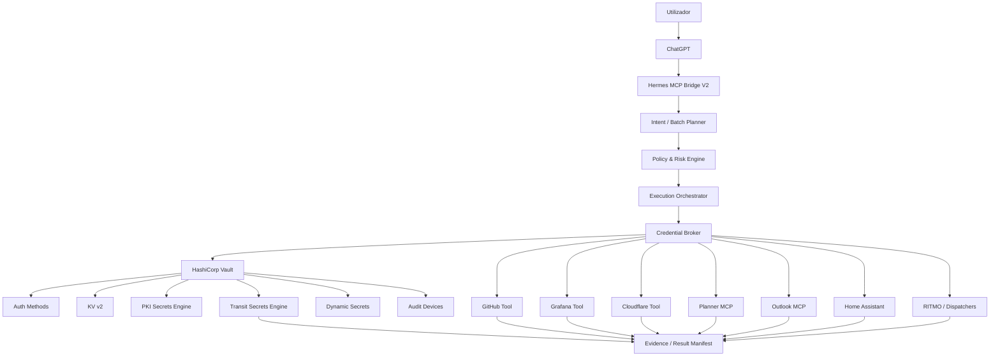
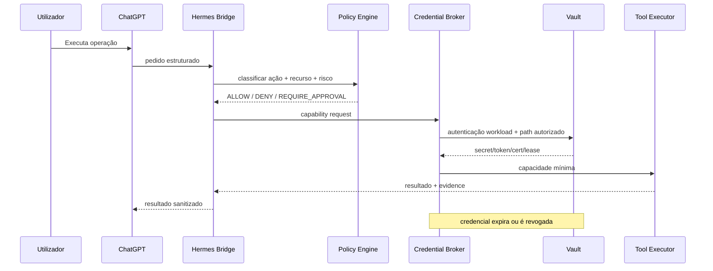
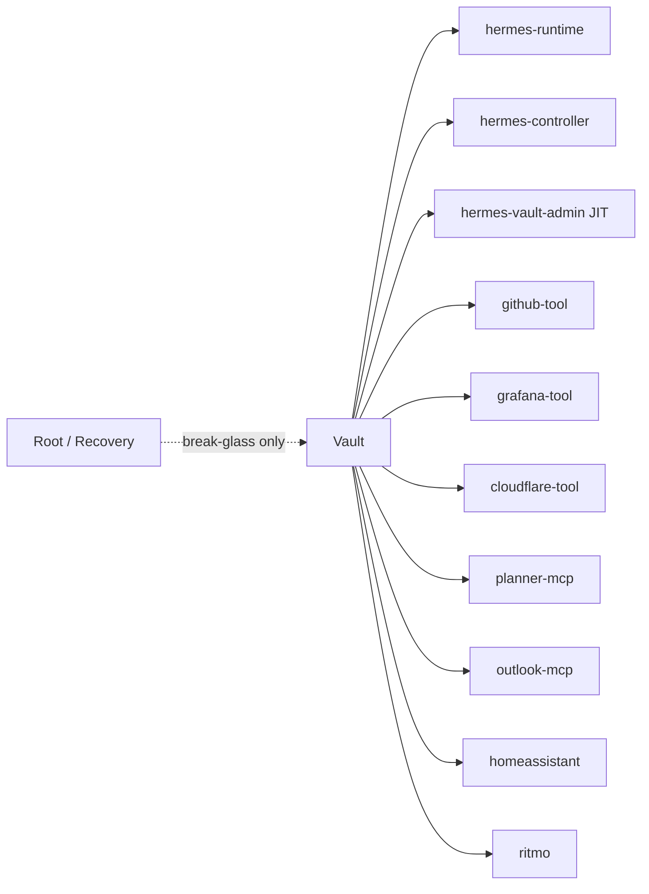

# 01 — Arquitetura de referência

## Visão lógica



## Fluxo normal L1/L2



## Trust boundaries

### TB-1 — ChatGPT ↔ Hermes MCP Bridge

- nenhum segredo deve atravessar esta boundary;
- pedidos devem ser expressos como intenção, ação e resource scope;
- outputs devem passar por redaction/sanitização.

### TB-2 — Bridge ↔ Policy/Risk Engine

- a decisão deve considerar identidade, ação, alvo, mutability, ambiente e nível de risco;
- ações privilegiadas podem exigir approval e/ou JIT elevation.

### TB-3 — Credential Broker ↔ Vault

- autenticação machine-to-machine;
- sem root token;
- tokens com TTL e policies restritas;
- uso de Vault Agent quando reduzir complexidade e exposição.

### TB-4 — Credential Broker ↔ Tool Executor

- fornecer apenas a capacidade necessária;
- preferir referência, file descriptor, memória temporária ou response wrapping a persistência em disco;
- cleanup após execução.

### TB-5 — Vault ↔ break-glass material

- recovery/unseal/root temporário ficam fora da cadeia normal do Hermes;
- acesso apenas em recuperação ou bootstrap controlado.

## Plano físico inicial recomendado

Primeira implementação deliberadamente simples:

```text
Jarvas host
├── vault.service
├── vault-agent.service
├── hermes-bridge.service
├── credential-broker.service   # pode começar embutido na Bridge
├── ritmo.service
├── dispatchers...
└── /var/lib/vault/              # Integrated Storage, permissões restritas
```

Evolução futura possível:

```text
Vault node/cluster dedicado
        │
        ├── TLS/mTLS
        ├── Integrated Storage HA
        ├── snapshots externos
        └── eventualmente Enterprise/HCP se requisitos justificarem
```

## Separação de identidades



## Modelo operacional desejado

A Bridge não pede «o token do GitHub». Pede uma capability:

```yaml
principal: hermes-controller
action: github.create_branch
resource: pestoura/example
risk: medium
requested_ttl: 5m
```

O Credential Broker resolve internamente:

1. qual identidade deve ser usada;
2. que policy permite a ação;
3. que secret engine/path contém ou gera a capacidade;
4. TTL/lease;
5. forma segura de entrega;
6. revogação/cleanup.

## Regra arquitetural

O Vault não deve tornar-se num novo monólito de confiança onde `hermes-controller` consegue ler indiscriminadamente tudo. O desenho deve privilegiar **delegação por tool identity**; o controller deve orquestrar, não concentrar todos os segredos em memória.
