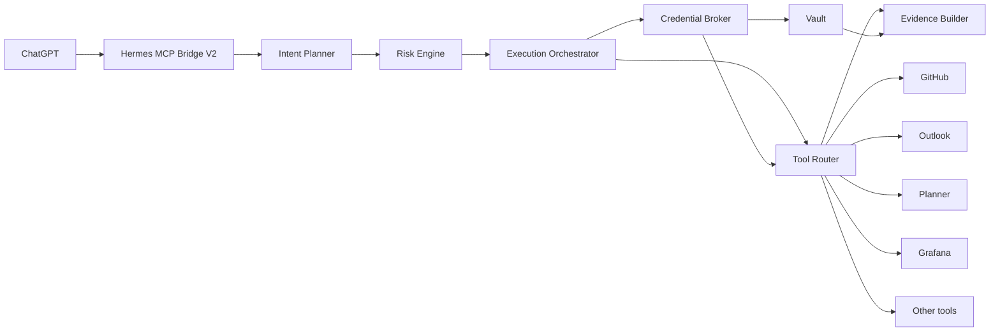
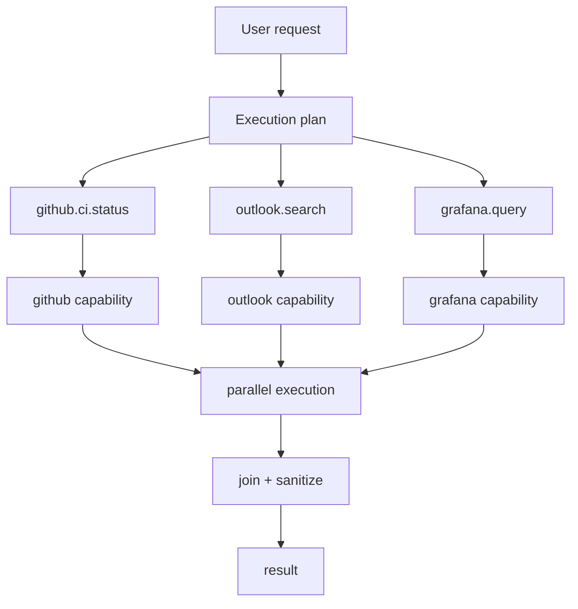

# 04 — Integração Hermes Bridge V2 e Credential Broker

## Objetivo

Integrar Vault na Hermes Bridge V2 sem transformar a Bridge num processo que mantém todos os segredos em memória.

## Componentes



## Credential Broker

O Broker abstrai o detalhe dos secrets engines e das credenciais externas.

### Entrada conceptual

```yaml
request_id: req-123
principal: hermes-controller
tool_identity: github-tool
action: github.create_branch
resource: pestoura/project
risk_class: medium
requested_ttl: 300
```

### Saída conceptual

O Broker pode devolver um dos seguintes tipos:

```yaml
capability:
  type: wrapped_secret | ephemeral_token | certificate | delegated_operation
  lease_id: optional
  expires_at: timestamp
  cleanup_required: true
```

Nunca devolver a capacidade no resultado destinado ao ChatGPT.

## Formas de entrega

Preferência, por ordem:

1. **delegated operation** — a operação criptográfica/secret-aware ocorre sem entregar a chave à tool;
2. **dynamic credential** — credencial gerada com lease curto;
3. **response wrapping** — entrega one-time com TTL curto;
4. **memory-only injection** — variável/processo efémero, sem persistência;
5. **tmpfs file** — apenas para aplicações que exigem ficheiro;
6. **static secret** — último recurso, ainda controlado por policy e audit.

## Batch execution

Uma das metas da Bridge V2 é tratar pedidos multi-sistema numa única chamada lógica.

Exemplo:

> “Procura o estado do CI no GitHub, confirma se chegou o email do deployment e valida as métricas do Grafana.”

Plano:



As três capabilities são independentes. Compromisso de uma não deve permitir acesso às restantes.

## Direct-tool execution

A V2 deve suportar dois caminhos:

### Fast path

```text
ChatGPT → Bridge → validated tool call → Credential Broker → tool
```

Usar quando:

- tool é determinística;
- schema conhecido;
- operação não necessita de raciocínio de agente intermédio;
- policy permite execução direta.

### Agent path

```text
ChatGPT → Bridge → Hermes Agent → subtask/tool → Credential Broker → tool
```

Usar quando é necessário raciocínio operacional, exploração ou coordenação complexa.

Vault suporta ambos; a escolha do path não altera o princípio de não exposição de segredos.

## Interface proposta do Broker

Operações futuras possíveis:

```text
capability.request
capability.renew
capability.revoke
capability.status
identity.resolve
secret.metadata
certificate.issue
transit.sign
transit.verify
```

Não expor genericamente `secret.read(path=*)` ao ChatGPT.

## Cancellation

Quando uma execução é cancelada:

1. parar novas tool calls;
2. revogar leases/tokens emitidos para a execução;
3. apagar tmpfs/material temporário;
4. fechar handles;
5. registar evidence de cancellation;
6. manter audit records.

## Correlation

Todos os eventos devem poder ser correlacionados por:

```text
execution_id
plan_id
request_id
tool_call_id
vault_request_id / lease_id (quando não sensível)
principal
resource_scope
```

## Sanitização

Nunca incluir em result manifests, logs do MCP ou respostas do modelo:

- tokens;
- SecretIDs;
- client secrets;
- private keys;
- passwords;
- wrapped payload depois de unwrap;
- recovery/unseal material.

## Resultado arquitetural

A autonomia do ChatGPT passa a ser definida por **ações e resources autorizados**, não por “que tokens o modelo conhece”.
