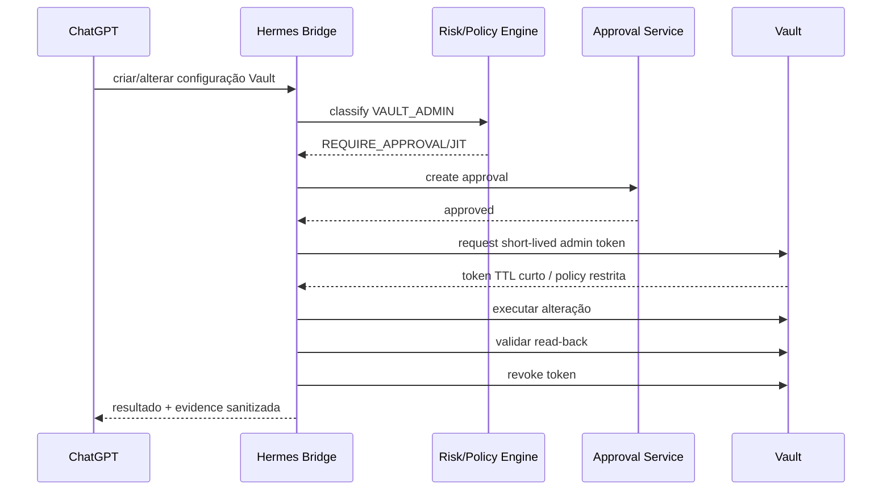

# 05 — JIT privilege elevation e administração Vault

## Objetivo

Permitir que ChatGPT/Hermes administre o próprio Vault quando necessário, sem manter uma identidade administrativa permanente nem expor root/recovery.

## Níveis de privilégio

| Nível | Identidade | Exemplo |
|---|---|---|
| L1 | `hermes-runtime` | consultas e operações normais |
| L2 | `hermes-controller` | gerir lifecycle de capabilities e integrações autorizadas |
| L3 | `hermes-vault-admin` | alterar auth methods, policies, roles, engines ou PKI em modo JIT |
| L4 | `root/recovery` | bootstrap e break-glass |

## Fluxo L3



## Requisitos do token JIT

Por defeito:

- TTL alvo: 5–15 minutos;
- não renewable;
- policy limitada ao conjunto de endpoints necessários;
- bound ao contexto de execução quando tecnicamente possível;
- revogação explícita após conclusão;
- audit obrigatório;
- evidence com before/after sem conteúdo secreto.

## Não usar uma única policy admin total

Sempre que possível, dividir por classes:

```text
vault-admin-policy
vault-admin-auth
vault-admin-pki
vault-admin-transit
vault-admin-secrets-engine
vault-admin-audit
vault-admin-storage
```

A elevação recebe apenas as classes necessárias à operação.

## Operações que podem ser automatizadas em L3

- criar ou alterar AppRoles;
- criar policies;
- ativar/tunar secret engines;
- criar roles PKI;
- criar/rodar Transit keys;
- configurar auth methods;
- revogar leases/tokens;
- ajustar TTLs;
- instalar/configurar audit devices;
- promover uma nova tool identity;
- desativar uma integração comprometida.

## Operações que ficam L4

- recuperação quando todas as identidades administrativas estão perdidas;
- geração de novo root temporário;
- ações que exigem recovery quorum;
- unseal/recovery extraordinário conforme seal design;
- reconstrução após perda catastrófica.

## Root token

Política pretendida:

```text
bootstrap → root inicial → configurar administração segura → revogar root
```

Se root voltar a ser necessário:

```text
recovery quorum → generate-root → reparação → revoke root
```

Root nunca deve existir como:

- secret KV acessível ao Hermes;
- variável de ambiente permanente;
- ficheiro em home directory;
- secret GitHub;
- valor em prompt;
- token guardado pelo Credential Broker.

## Approvals

A Bridge já possui um conceito de approvals. A integração Vault deve reutilizar esse mecanismo, acrescentando:

- `mutation_class`;
- resource scope;
- requested capabilities;
- TTL;
- identity assurance;
- plan hash;
- stale-on-plan-change;
- consume-once.

## Break-glass humano

O operador humano deve conseguir recuperar o Vault mesmo que ChatGPT, Hermes, Bridge, Vault Agent e GitHub estejam indisponíveis.

Isto implica documentação offline de:

1. localização do material de recovery;
2. quorum necessário;
3. comandos/procedimento de recuperação;
4. como gerar root temporário;
5. como revogar root após reparação;
6. como restaurar snapshot;
7. como reemitir identidades de workloads.

## Segurança adicional

Uma operação L3 deve falhar se:

- o approval expirou;
- o plan hash mudou;
- a identity assurance é insuficiente;
- o resource scope não corresponde;
- o Vault audit não está operacional, exceto num runbook de recuperação explicitamente autorizado;
- o token JIT não foi obtido com os constraints previstos.
