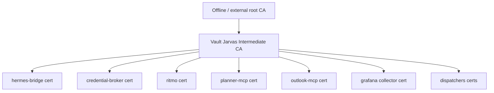
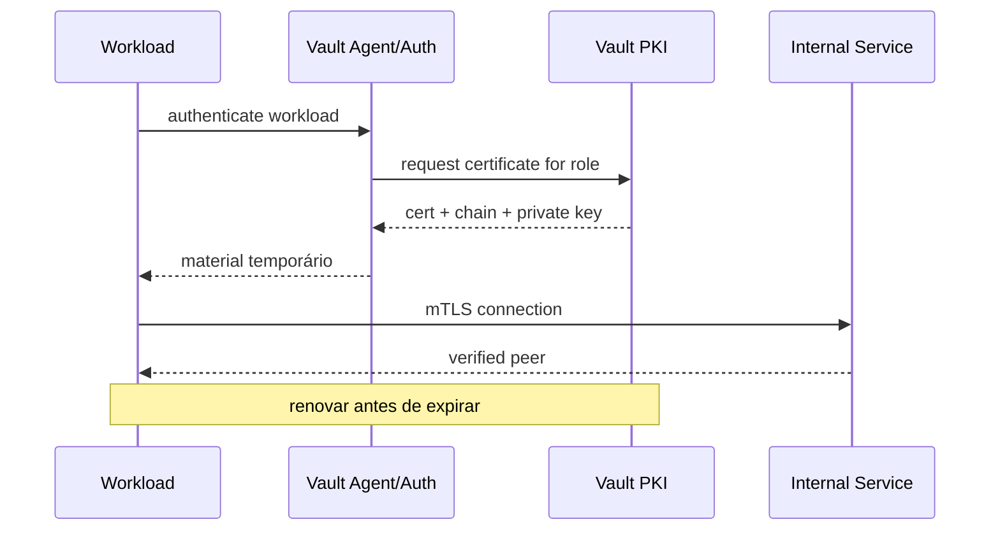

# 06 — PKI, certificados e mTLS

## Objetivo

Usar o Vault PKI Secrets Engine para emitir certificados de curta duração e criar identidade criptográfica entre componentes internos do Jarvas/Hermes.

## Arquitetura proposta



A decisão final sobre root CA deve ser tomada durante implementação. Para maior resiliência, preferir root offline/external e Vault como CA intermédia, se a complexidade operacional for aceitável.

## Roles PKI propostas

```text
pki/roles/hermes-bridge
pki/roles/credential-broker
pki/roles/ritmo
pki/roles/planner-mcp
pki/roles/outlook-mcp
pki/roles/dispatchers
pki/roles/observability
```

Cada role deve limitar:

- nomes/SANs permitidos;
- TTL máximo;
- key type/size conforme baseline;
- server/client usage;
- domains autorizados;
- possibilidade de subdomains/wildcards.

## TTL

Começar conservadoramente e reduzir após automatizar renovação.

Exemplo de progressão:

```text
fase de bootstrap: 24h
fase estável:      4–12h
workloads maduros: 1–4h quando renovação estiver validada
```

Não reduzir TTL antes de existir monitorização e renovação automática confiável.

## mTLS

Prioridades:

1. Hermes Bridge ↔ Credential Broker;
2. Bridge/Broker ↔ APIs internas;
3. RITMO ↔ componentes que aceitem mTLS;
4. MCPs internos expostos por HTTP;
5. collectors/exporters sensíveis.

## Fluxo



## Private keys

Preferências:

- gerar com proteção local adequada;
- armazenar em tmpfs quando ficheiro for inevitável;
- permissões `0600` e ownership específico;
- nunca commit no GitHub;
- nunca logar;
- renovar e eliminar material expirado.

## Revogação

O sistema deve suportar:

- revogação de certificado comprometido;
- CRL operacional quando aplicável;
- rotação da intermediate CA;
- overlap controlado durante rotação;
- deteção de certificados perto de expirar.

## Integração com jarvas-operations

Adicionar assurance checks futuros:

```text
VAULT_PKI_HEALTH
VAULT_CA_EXPIRY
VAULT_CERT_EXPIRY
VAULT_CERT_RENEWAL
VAULT_CRL_FRESHNESS
MTLS_ENDPOINT_VALIDATION
```

## Não-objetivo

mTLS interno não substitui autorização de aplicação. O certificado prova identidade criptográfica; a policy continua a decidir o que essa identidade pode fazer.
