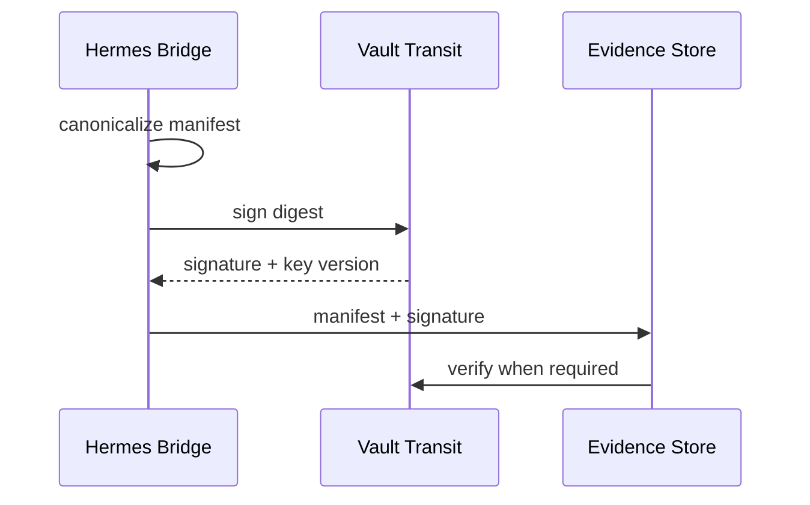

# 07 — Transit, signing, HMAC e evidência

## Objetivo

Usar o Vault Transit Secrets Engine como serviço criptográfico central sem distribuir as chaves privadas aos componentes consumidores.

## Chaves propostas

```text
transit/keys/hermes-execution-signing
transit/keys/hermes-evidence-signing
transit/keys/hermes-hmac
transit/keys/sensitive-field-encryption
```

A implementação real deve escolher tipos de chave e operações suportadas de acordo com o caso de uso e versão do Vault.

## 1. Execution manifest signing

A Bridge pode produzir um manifesto antes/depois de operações relevantes:

```yaml
execution_id: run-...
plan_id: plan-...
principal: chatgpt-supervisory-controller
action: github.merge_pr
resource: pestoura/example
policy_decision: allow
timestamp: ...
result: success
```

O manifesto é canonicalizado e enviado ao Transit para assinatura.



## 2. Evidence signing

Evidence bundles produzidos por `jarvas-operations`, acceptance harnesses ou operações administrativas podem ser assinados para permitir deteção de alteração posterior.

Guardar no bundle:

```text
algorithm
key_name
key_version
signature
content_digest
timestamp
```

Nunca guardar a chave privada.

## 3. HMAC

Aplicações possíveis:

- integridade/autenticidade de mensagens internas;
- correlation payloads;
- request signing entre componentes quando mTLS por si só não cobre o requisito;
- preservar compatibilidade com mecanismos HMAC já existentes na Bridge sem gerir a chave localmente.

A key de HMAC deve permanecer no Vault.

## 4. Cifragem de campos sensíveis

Transit pode cifrar valores antes de estes serem persistidos em state DB ou evidence stores.

Exemplos potenciais:

- identificadores sensíveis que precisem de ser recuperáveis;
- material de configuração sensível que não deva ficar em claro;
- payloads temporários persistidos por necessidade operacional.

Não cifrar indiscriminadamente tudo: classificação de dados e necessidade de pesquisa/indexação devem ser avaliadas.

## 5. Key rotation

A rotação deve ser operacionalmente testada.

Requisitos:

- registar `key_version` nas assinaturas/ciphertexts;
- testar verify/decrypt de material histórico;
- definir `min_decryption_version` e outras restrições apenas quando o histórico o permitir;
- manter runbook de compromise/rotation.

## 6. Separação de funções

Não usar a mesma Transit key para tudo.

```text
execution signing ≠ evidence signing ≠ HMAC ≠ field encryption
```

Isto reduz blast radius e permite políticas/rotação independentes.

## 7. Evidence chain

Fluxo alvo:

```text
request
  ↓
policy decision
  ↓
capability issuance / lease
  ↓
tool execution
  ↓
result manifest
  ↓
Transit signature
  ↓
evidence storage
  ↓
verification during assurance/audit
```

## 8. Falhas

Para operações classificadas como requiring signed evidence:

- falha do Transit deve impedir a conclusão como `SUCCESS_SIGNED`;
- não inventar assinatura local de fallback;
- classificar o resultado como blocked/degraded conforme política;
- preservar informação suficiente para investigação sem guardar segredos.

## Resultado

Transit transforma o Vault numa parte do **trust plane**, não apenas do secrets plane: as aplicações pedem operações criptográficas sem receber as chaves que sustentam essa confiança.
