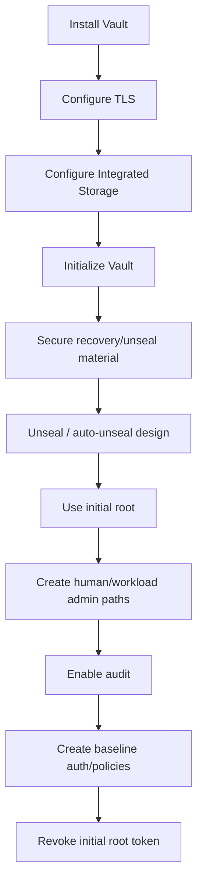

# 09 — Bootstrap, unseal, recovery e break-glass

## Objetivo

Garantir que o Vault pode ser iniciado, recuperado, restaurado e administrado em emergência sem depender do ChatGPT/Hermes.

## Princípio

```text
Hermes administra operação normal.
Hermes pode obter administração L3 JIT.
Hermes NÃO possui recovery/unseal/root permanente.
```

## Bootstrap inicial

Fluxo previsto:



## Seal design

Durante implementação deve ser escolhida explicitamente uma das estratégias suportadas e adequadas ao ambiente:

- Shamir/manual unseal;
- auto-unseal através de mecanismo externo suportado, se disponível e justificável.

A decisão deve considerar que o Jarvas é um ambiente pessoal/self-hosted e evitar dependência externa que reduza a recuperabilidade.

## Recovery material

Não guardar recovery/unseal material:

- no GitHub;
- no Vault que ele próprio desbloqueia;
- em `.env` do Jarvas;
- em scripts;
- no Hermes state DB;
- no ChatGPT;
- em logs;
- em backups não cifrados.

Modelo desejado:

```text
Recovery material
├── primary encrypted/offline copy
├── independent backup copy
└── documented quorum/procedure
```

A localização concreta não deve ser documentada neste repositório se isso aumentar o risco.

## Root

### Bootstrap

O initial root token é transitório.

```text
initialize → configure secure administration → validate → revoke root
```

### Emergency root

Quando indispensável:

```text
recovery quorum
  ↓
operator generate-root
  ↓
temporary root
  ↓
repair/recover
  ↓
validate
  ↓
revoke root
```

## Snapshots

Com Integrated Storage, definir política de snapshots.

Baseline proposto:

- snapshot automático diário;
- retenção curta local;
- cópia cifrada independente;
- checksums/metadata;
- teste periódico de restore;
- não considerar backup “válido” apenas porque o ficheiro existe.

## Restore test

Executar sempre em ambiente isolado/não produtivo.

Acceptance mínimo:

1. iniciar instância Vault isolada compatível;
2. restaurar snapshot;
3. validar storage/metadata;
4. autenticar com identidade de teste;
5. ler secret fictício de acceptance;
6. validar policy deny;
7. validar Transit/PKI metadata conforme aplicável;
8. destruir ambiente de teste.

Não copiar recovery/root material real para pipelines ou GitHub Actions.

### ADR-023 — execução isolada

O restore drill canónico usa o harness `docs/runbooks/restore-drill.md`. O container de teste corre com `network=none`, zero portas publicadas, imagem Vault pinned e sem volumes/redes do Vault de produção.

O repositório pode preparar snapshot cifrado/checksummed, fixtures sintéticos, runtime isolado, status, acceptance e teardown. A inicialização temporária, o `snapshot-force` e o unseal pós-restore com as **original Shamir shares** são HITL operator-only. Nenhuma share, root/token ou localização de custódia é entregue à automação.

Estado repository-side: `ADR023_REPO_READY_LIVE_HITL_PENDING`. `RESTORE_DRILL_PASS` permanece `NOT_RUN` até uma execução real completar force-restore, quorum original, acceptance e teardown no mesmo run.

## Disaster scenarios

### Vault process down

- restart controlado;
- verificar storage;
- validar sealed state;
- validar audit e auth;
- acceptance test.

### Host loss

- reconstruir host a partir de IaC/config baseline;
- recuperar TLS/bootstrap prerequisites;
- restaurar snapshot;
- recuperar/unseal de forma controlada;
- reemitir workload identities se necessário.

### Credential compromise

- revogar token/lease;
- desativar AppRole/cert/identity afetada;
- rodar segredo externo se estático;
- rever audit;
- reemitir identidade;
- assinar evidence do incidente/recuperação.

### Policy compromise/misconfiguration

- bloquear identidade afetada;
- comparar com baseline Git;
- restaurar policy conhecida;
- executar negative tests;
- só depois reativar automação.

### Loss of all normal admins

- acionar break-glass;
- usar recovery quorum;
- gerar root temporário;
- recriar administração normal;
- revogar root;
- produzir evidence.

## Runbook offline

Deve existir uma versão exportável/offline do procedimento de recuperação para utilização quando GitHub/Hermes não estiverem acessíveis.

## Gate obrigatória antes de produção

Não declarar Vault production-ready até existir pelo menos um **restore drill bem-sucedido** e documentado.
